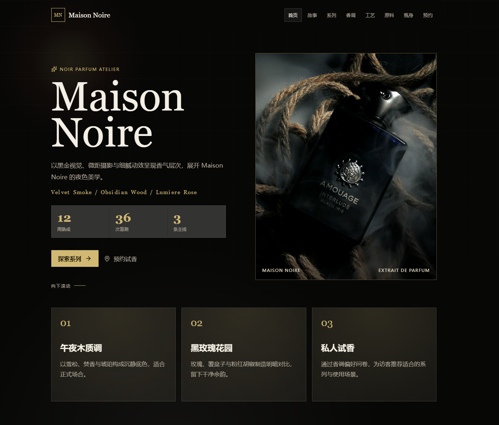

# Maison Noire

一个高端香水品牌展厅网站，展示品牌故事、产品系列与工艺美学。

## 预览



## 功能特点

- 🎨 **沉浸式视觉体验** - 精美的品牌故事展示与产品呈现
- 📱 **响应式设计** - 完美适配桌面端与移动端
- 🎬 **多媒体展示** - 支持视频与音频内容
- 🌙 **优雅的深色主题** - 契合品牌调性的视觉设计

## 页面结构

| 页面 | 描述 |
|------|------|
| `index.html` | 品牌首页 |
| `story.html` | 品牌故事 |
| `collection.html` | 产品系列 |
| `bottles.html` | 香水瓶展示 |
| `notes.html` | 香调介绍 |
| `ingredients.html` | 原料工艺 |
| `craft.html` | 制作工艺 |
| `contact.html` | 联系方式 |

## 本地运行

### 方式一：使用启动脚本（推荐）

双击 `启动网站.bat` 即可自动启动本地服务器并打开网站。

### 方式二：手动启动

需要 Node.js 环境：

```bash
npx serve html
```

或使用 Python：

```bash
cd html
python -m http.server 3000
```

然后访问 `http://localhost:3000`

### 手机访问

启动网站后，终端会显示局域网地址（如 `http://192.168.x.x:3000`），确保手机和电脑连接同一 Wi-Fi，即可在手机浏览器中访问。

## 技术栈

- **HTML5** - 语义化结构
- **CSS3** - 现代样式与动画
- **JavaScript (ES6+)** - 交互逻辑
- **Vite** - 构建工具

## 项目结构

```
Maison_Noire/
├── html/           # 页面文件
├── css/            # 样式文件
├── js/             # 脚本文件
├── images/         # 图片资源
├── videos/         # 视频资源
├── audios/         # 音频资源
├── tools/          # 工具脚本
└── 启动网站.bat     # 启动脚本
```

## 作者

[Fywing](https://github.com/Fywing)

## License

MIT License